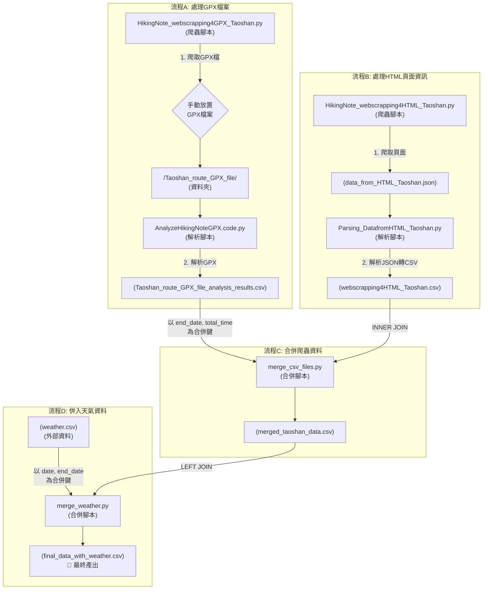

# HikingNote 爬山筆記分析專案

這是一個分析健行筆記網站資料的專案，包含爬取 GPX、HTML 頁面資訊，並整合天氣資料進行分析。

## 資料處理流程圖




---

# HikingNote 爬蟲程式說明文件

## **專案背景**
本專案旨在開發一個針對 HikingNote 網站的爬蟲程式，目的是自動化下載 GPX 檔案。然而，在開發過程中，我們遇到了一些伺服器防範自動化工具（如 Selenium）的機制，導致部分功能無法正常運作。

---

## **被偵測為 Selenium 的程式碼**
以下是觸發伺服器防範機制的程式碼段：

```python
prefs = {
    "profile.default_content_settings.popups": 0,  # 禁止彈出下載框
    "download.default_directory": DOWNLOAD_DIR,   # 設定下載目錄
    "directory_upgrade": True                     # 自動覆蓋下載目錄
}
```

---

## **問題分析**

### **1. 禁用的功能過於明顯**
為了提升自動化效率，我們在程式中禁用了部分功能（如 `--disable-popup-blocking` 和 `--disable-notifications`）。然而，這些選項可能被伺服器識別為自動化工具的行為，進而觸發防範機制，導致下載功能受限。

### **2. 下載目錄的設定暴露**
我們使用了 `prefs` 來設定下載目錄 (`DOWNLOAD_DIR`)，雖然這樣可以方便地將檔案存放到指定位置，但某些伺服器可能會檢測到這些異常行為，進而阻止檔案下載。

---

## **目前行為**

### **1. 檔案下載位置**
程式能正常爬取檔案，但下載的 GPX 檔案會直接存放到使用者的 **Downloads 資料夾**中，而非我們指定的目錄（如 `桃山GPX檔`）。

### **2. 下載彈出視窗**
在下載 GPX 檔案時，瀏覽器會跳出彈出視窗，要求使用者手動點擊確認下載，無法完全自動化。

---

## **結論**
目前的爬蟲程式雖然可以正常執行爬取流程，但在下載檔案的部分仍需要人工介入。具體表現如下：
- **檔案存放問題**：檔案會存放到使用者的 **Downloads 資料夾**，而非我們指定的目錄。
- **手動下載問題**：下載過程需要手動點擊彈出視窗的確認按鈕。

這些問題的根本原因在於伺服器的反自動化機制，未來需要進一步優化程式以解決這些限制。


---

這樣的 README 文件結構清晰，內容全面，適合用於團隊內部溝通或對外展示專案成果。你可以根據需要進一步調整措辭或新增細節！
